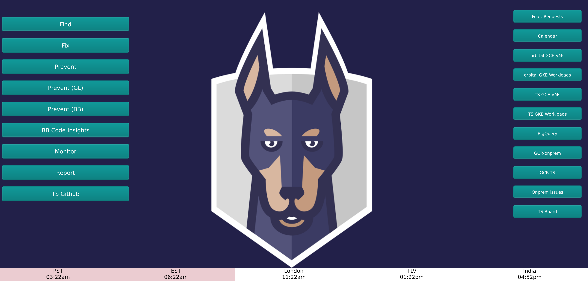

# Snyk Shortcut extension
 

## Installation
1. git clone this repo wherever you want on your drive.
2. Get into Chrome extension following [chrome://extensions](chrome://extensions) url.
3. Click on `Load Unpacked` and point to the folder, press enter.
4. Open a new tab and profit.

## Customize your links/button

Customize the anything you want in newtab.html.
You can tweak the styling in the CSS part as well.

Once done, go back to [chrome://extensions](chrome://extensions) and click on the update circular arrow to get your changes updated.

## Launch apps/scripts from the extension.

You can trigger things from a button (I was launching my jenkins local instance for example).
Basic flow is Button -> json definition -> shell script

The json files indicates the details, triggering the startJenkins.sh which itself was booting up things via a bash alias in my case.
The js script has an event listener that triggers chrome.management.launchApp(ext.id). This is how the button gets connected to the chrome communication api to then fire off the shell script which path is specified in the json file.
Might require some experimentation to get it right.
